# Playwright Framework

Compact Playwright examples for UI automation, browser-side JavaScript execution, and API testing.

## What This Repo Covers

- page object based UI tests
- custom Playwright fixtures
- `page.evaluate(...)` for browser-context execution
- Shadow DOM and JavaScript dialog handling
- API tests with Playwright `request`, `fetch`, and `axios`
- automatic waiting and locator patterns

## Stack

- Node.js
- Playwright Test
- Axios
- Pino
- Yarn 4

## Project Layout

```text
fixtures/
  base.js

pages/
  alerts.pages.js
  base.page.js
  login.page.js
  secure.page.js
  shadowdom.page.js

tests/
  api/
    dummyjson.spec.js
    jsonplaceholder.spec.js
  autowait.spec.js
  jse.spec.js
  login.spec.js
  shadowdom.spec.js

utils/
  logger.js
```

## Getting Started

Install dependencies:

```bash
yarn install
```

Install Playwright browsers:

```bash
npx playwright install
```

## Running Tests

Run everything:

```bash
npx playwright test
```

Run a single file:

```bash
npx playwright test tests/login.spec.js
```

Open the HTML report after a run:

```bash
npx playwright show-report
```

## Configuration

The Playwright config is in [`playwright.config.js`](/Users/life/code/automation/playwright-framework/playwright.config.js).

Current defaults:

- `testDir: ./tests`
- fully parallel execution locally
- `retries: 2` on CI, `0` locally
- `workers: 1` on CI
- HTML reporter
- trace collection on first retry
- projects for `chromium`, `firefox`, and `webkit`

## Test Coverage

### UI

- `tests/login.spec.js`
  - login flow using a custom fixture and page objects
  - logout verification

- `tests/jse.spec.js`
  - login by writing to the DOM inside `page.evaluate(...)`
  - JavaScript alert handling
  - JavaScript prompt handling

- `tests/shadowdom.spec.js`
  - reads and verifies content rendered inside Shadow DOM

- `tests/autowait.spec.js`
  - AJAX loading example
  - assertion timing and explicit wait comparison

### API

- `tests/api/jsonplaceholder.spec.js`
  - compares `axios`, Playwright `request`, and native `fetch`
  - validates the same response contract across clients

- `tests/api/dummyjson.spec.js`
  - authenticates once in `beforeAll`
  - creates and fetches articles through Playwright `request`
  - includes skipped examples for `fetch` and `axios` login calls

## Page Objects and Fixtures

The UI tests follow a simple page object model:

- `pages/base.page.js` holds shared behavior
- feature-specific page classes wrap selectors and actions
- `fixtures/base.js` exposes reusable test fixtures such as `loginPage`

This keeps the specs focused on behavior instead of selector plumbing.

## Why Playwright Feels Different

Playwright builds waiting into actions and assertions. That changes the style of test code:

```js
await page.getByRole('button', { name: 'Login' }).click();
await expect(page.locator('.bg-success')).toHaveText(
  'Data loaded with AJAX get request.'
);
```

In most cases you assert against locators and let Playwright retry, instead of manually polling DOM state.

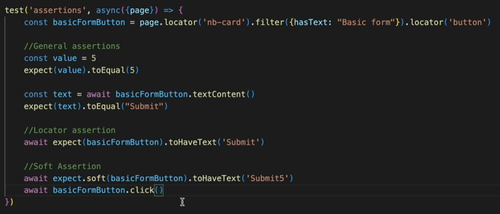

## Browser-Side JavaScript Execution

`page.evaluate(...)` runs code in the browser context, not in Node.js. This repo uses it to:

- read browser state like `document.title`
- fill fields directly through DOM APIs
- trigger clicks from inside the page
- return serialized data back to the test

```text
Node.js -> Playwright -> Browser -> execute function -> return serialized value
```

## API Client Comparison

The API examples show three common ways to call HTTP endpoints in Playwright projects:

- Playwright `request` for runner-integrated API testing
- native `fetch` for minimal platform APIs
- `axios` for a standalone client library

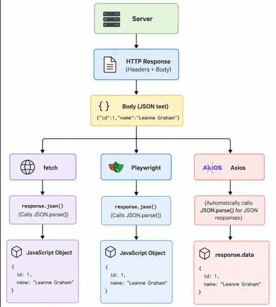
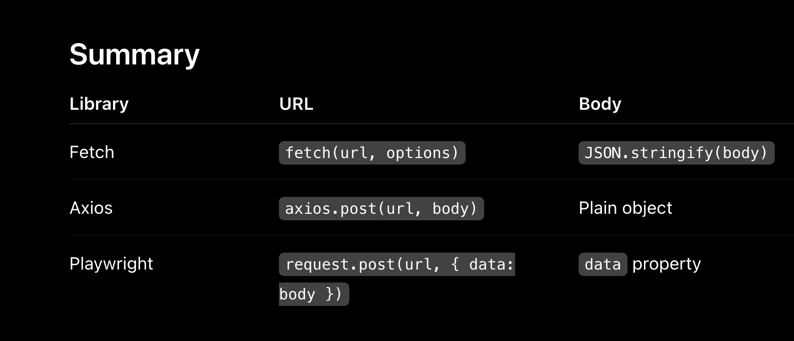

## Locator Patterns

This repo leans on user-facing locators and locator chaining rather than brittle CSS-only selectors.

```js
page
  .locator('#login')
  .getByRole('button', { name: 'Login' });
```

Useful patterns shown in the included diagrams:

- visible-text and accessible-role locators
- parent-scoped locators
- `hasText` and `has` filtering
- extracting values from located elements
- locator assertions vs raw DOM reads

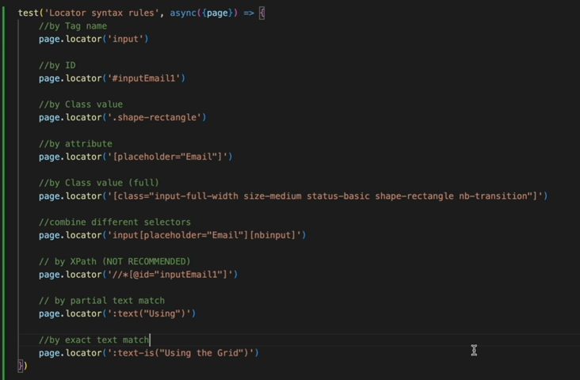
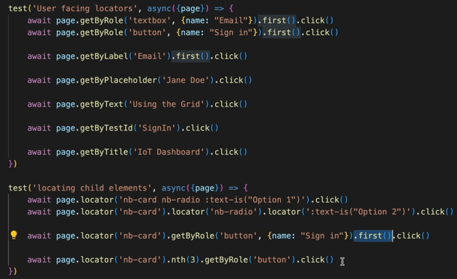
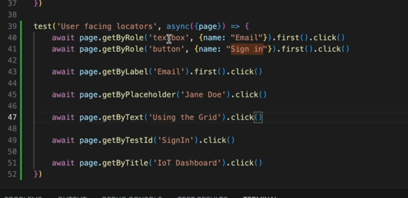
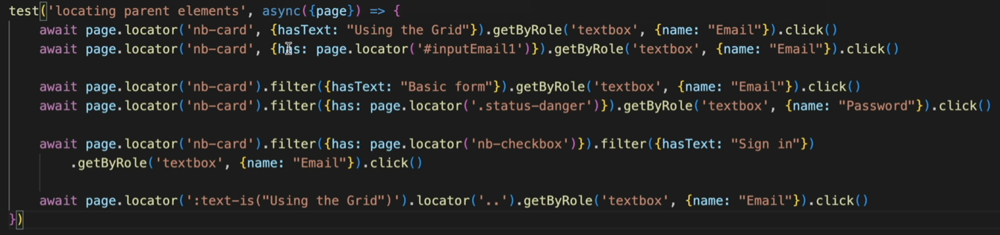
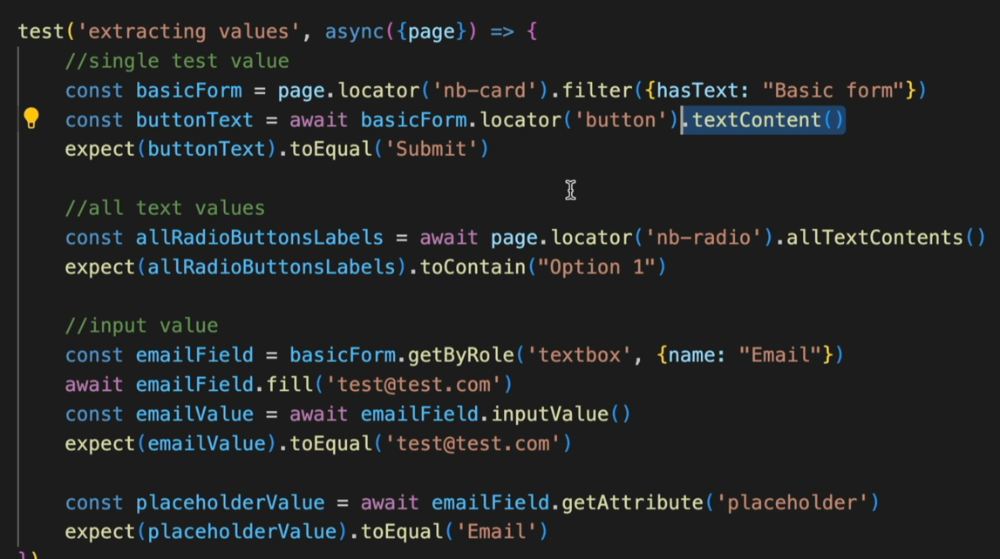
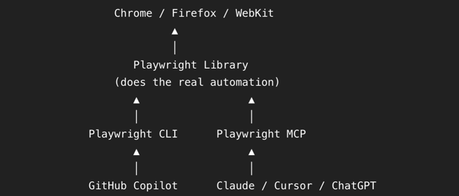

## MCP Server Flow

This diagram shows how an AI agent can call a Playwright MCP server, which then drives the browser through Playwright.

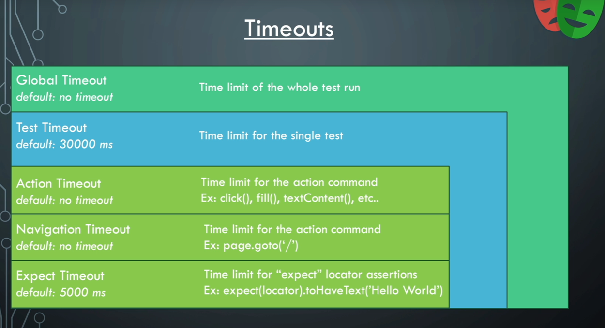

## Notes

- Some API tests depend on external services and network availability.
- `tests/api/dummyjson.spec.js` contains skipped login examples and active Conduit article flows.
- The repo is example-driven; it is not packaged as a reusable framework library.

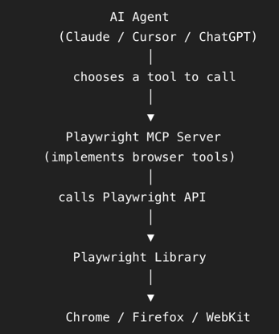

CI
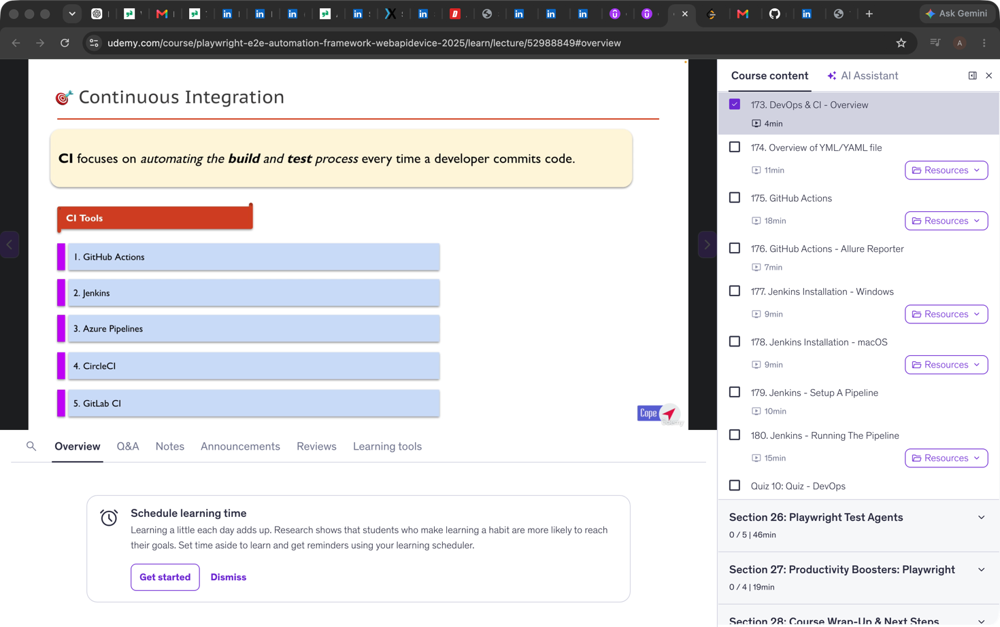
